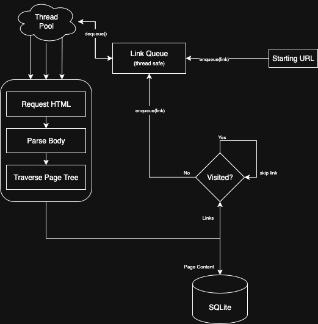
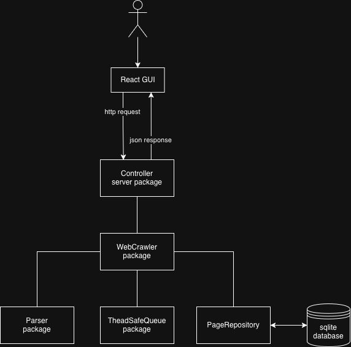

# Webcrawler, Indexer and WebServer in Go
## Functionality
- Crawls a domain given a seed (initial url)
- Search through keywords and recieve url
- See statistics of words (most/least used)

## Topics Covered

- Concurrency & Multithreading in Go
- Docker Containers
- Restful API’s in Go
- Object Oriented Programming in Go

## Tech Stack
### Frontend (Hosted on Vercel)
- React
- Typescript
- Vite
- Tailwind

### Backend (All Self Hosted)
- GoLang (WebServer)
- GoLang (WebCrawler)
- SQLite Database

# Implementation
### System Diagram of the Webcrawler

<br>
The diagram above shows the system diagram of the webcrawler, It checks a thread safe link queue and, requests, parses, traverses the link. Once this process is complete it then extracts the page text content and links contained within the page. The content is saved to a SQLite database to be queried by endpoints whilst the other links are checked to see if it has been visited already / exist within link queue and either skips it or enqueues it to the link queue. This process is repeated until a fixed number of pages are crawled

### Package Structure

<br>
The diagram above shows the general package hierarchy and structure for this application. The server package (controller) exposes the endpoints, and uses the webcrawler package to handle webcrawling logic, which that too delegates parsing, thread safety and data store to their own packages. The unit tests for each repository is located in the same directory labeled *_test.go 
## Endpoints

<details>
<summary>POST /api/v1/crawl</summary>

### Description

Starts a web crawl for the specified URL and stores the extracted pages in the database. The crawl runs asynchronously and can follow internal links up to a configurable depth.

### HTTP Method & URL

`POST /api/v1/crawl`

### Request Body

```json
{
  "url": "https://example.com",
  "maxDepth": 2,
  "followExternal": false
}
```

| Field          | Type    | Required | Description                                         |
| -------------- | ------- | -------- | --------------------------------------------------- |
| url            | string  | yes      | The starting URL to crawl                           |
| maxDepth       | int     | no       | Maximum link depth to crawl (default: 2)            |
| followExternal | boolean | no       | Whether to follow external domains (default: false) |

</details>

<details>
<summary>GET /api/v1/search?q={query}&limit={limit}</summary>

## Description

Searches through the database to find keywords within crawled web pages. Returns a list of URL’s and Title’s where the keyword appears.

## HTTP Method & URL

`GET /api/v1/search?q={query}&limit={limit}`

## Query Parameters

| Parameter | Type   | Required | Description                                       |
| --------- | ------ | -------- | ------------------------------------------------- |
| q         | string | yes      | The search query (keywords or phrase)             |
| limit     | int    | no       | Maximum number of results to return (default: 10) |

## Example Response

```json
{
  "results": [
    {
      "url": "https://example.com/page1",
      "title": "Learning Go Networking"
    },
    {
      "url": "https://example.com/page2",
      "title": "Go Concurrency Basics"
    }
  ]
}
```

</details>

---
