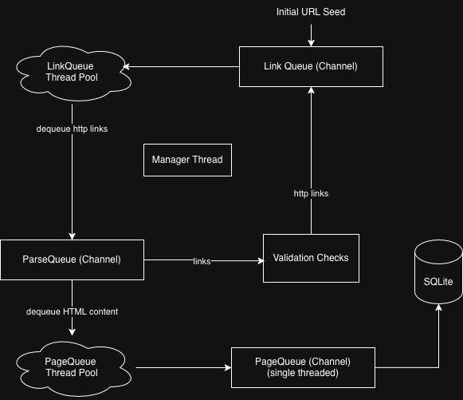
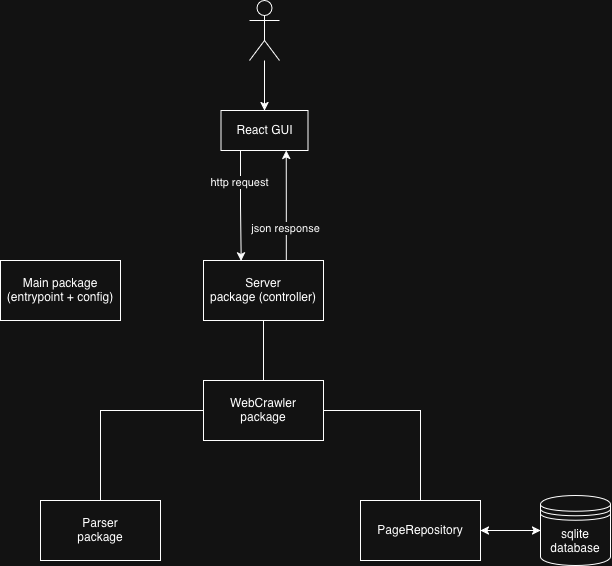

# Table of Contents
1. [Introduction](#webcrawler-indexer-and-webserver-in-go)
2. [Functionality](#functionality)
3. [Tech Stack](#tech-stack)
   - [Frontend](#frontend-hosted-on-vercel)
   - [Backend](#backend-all-self-hosted)
4. [Implementation](#implementation)
   - [System Diagram of the Webcrawler](#system-diagram-of-the-webcrawler)
   - [Package Structure](#package-structure)
5. [Endpoints](#endpoints)
   - [POST /api/v1/crawl](#post-apiv1crawl-start-a-crawl)
   - [GET /api/v1/search](#get-apiv1search-search-crawled-pages)
   - [GET /api/v1/health](#get-apiv1health-server-health)
   - [GET /api/v1/*](#get-apiv1-catchall-endpoint)

---


## Webcrawler, Indexer and WebServer in Go
This project contains a fully functional webcrawler and web server written in go, within the client directory, that saves all content to a SQLite database (wiped every 4 hours).
The crawler is interactable via a webserver with two main endpoints (found below). The server directory contains a React Typescript Vite application that acts as a simple GUI to interact with the webcrawler backend

## Project Structure

### Server

- `/server/`  
  The server-side code and logic. Includes the backend server, webcrawler, and SQLite-related code.

- `/server/cmd/webcrawler/`  
  Entry point of the backend Go webcrawler and server.

- `/server/internal/`  
  Package root directory for the Go backend. Includes the server and webcrawler packages.

- `/server/data/`  
  Contains the SQLite database and `schema.sql` file to generate it.

---

### Client

- `/client/`  
  Root of the Vite React application.

- `/client/src/components/`  
  Contains all custom React components.


## Tech Stack
### Frontend (Hosted on Vercel)
- React
- Typescript
- Vite

### Backend (All Self Hosted)
- Go Webserver package
- Go Webcrawler package
- SQLite Database

# Implementation
### System Diagram of the Webcrawler

<br>
The diagram above shows the general design and architecutre of the webcrawler. There four key components. The Fetching of the URL's HTML, the parsing of the HTML to extract text content and href links, the insertion of the content and metadata to the SQLite database and finally the validation of the Href that feeds back to the link queue.
<br>
<br>
For this project i decided to go with a worker pool architecture, where we have two worker pools that manage fetching of links, a heavily blocking action, and one for parsing, a computationally heavy action. The insertion to the database is only done via one woker, where it reads from a queue to insert from. This is done as writing to the database in SQLite is not thread safe. The validation of links goes through many checks and builds links from either relative or absolute path.
<br>
<br>
Finally there is the manager woker which detects wether there is any action pending between the worker pools. If not this implies that there is nothing left to parse and we can terminate all workers and return a valid http response to the client.

### Package Structure

<br>
The diagram above shows the general package hierarchy and structure for this application. The server package (controller) exposes the endpoints, and uses the webcrawler package to handle webcrawling logic, which that too delegates parsing and data store to their own packages. The unit tests for each repository is located in the same directory labeled *_test.go 
## Endpoints

<details>
<summary>POST /api/v1/crawl</summary>

### Description

Starts a web crawl for the specified URL and stores the extracted pages in the database. The crawl runs asynchronously and can follow internal links up to a configurable depth.

### HTTP Method & URL

`POST /api/v1/crawl`

### Request Body

```json
{
  "url": "https://example.com",
  "maxDepth": 2,
  "followExternal": false
}
```

| Field          | Type    | Required | Description                                         |
| -------------- | ------- | -------- | --------------------------------------------------- |
| url            | string  | yes      | The starting URL to crawl                           |
| maxDepth       | int     | no       | Maximum link depth to crawl (default: 2)            |
| followExternal | boolean | no       | Whether to follow external domains (default: false) |

## Example Response

```json
{
    "pagesCrawled": "24",
    "status": "completed"
}
```

</details>

<details>
<summary>GET /api/v1/search?q={query}&limit={limit}</summary>

### Description

Searches through the database to find keywords within crawled web pages. Returns a list of URL’s and Title’s where the keyword appears.

### HTTP Method & URL

`GET /api/v1/search?q={query}&limit={limit}&domain={domain}`

### Query Parameters

| Parameter | Type   | Required | Description                                       |
| --------- | ------ | -------- | ------------------------------------------------- |
| q         | string | yes      | The search query (keywords or phrase)             |
| limit     | int    | no       | Maximum number of results to return (default: 10) |
| url       | string | no       | Domains to search for (wild card "" is invalid)   |


### Example Response

```json
  [
    {
      "url": "https://example.com/page1",
      "title": "Learning Go Networking",
      "content":"--all website content on this page--"
    },
    {
      "url": "https://example.com/page2",
      "title": "Go Concurrency Basics",
      "content":"--all website content on this page--"

    }
  ]
```

</details>

<details>
<summary>GET /api/v1/health</summary>

### Description
Displays server statistics and health. This endpoint of purely for logging reasons and threat detection.

### HTTP Method & URL

`GET /api/v1/health`

### Example Response

```json
{
    "health": "OK",
    "totalCrawlEndpointsServed": 2,
    "totalPagesCrawled": 48,
    "totalSearchEndpointsServed": 4
}
```
</details>

<details>
<summary>GET /api/v1/*</summary>

### Description

Catchall for unknown HTTP url request endpoints

### HTTP Method & URL

`GET /api/v1/*`

### Example Response

```json
{
    "error": {
        "code": "ENDPOINT_NOT_FOUND",
        "message": "The requested endpoint does not exist.",
        "method": "GET",
        "path": "/api/v1/unknown"
    }
}
```

</details>


---

